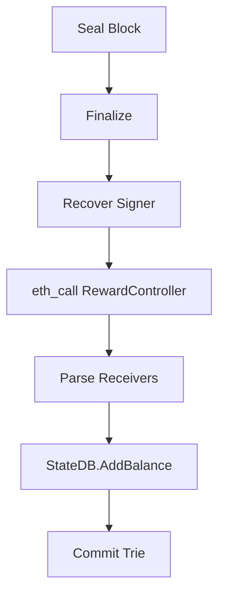
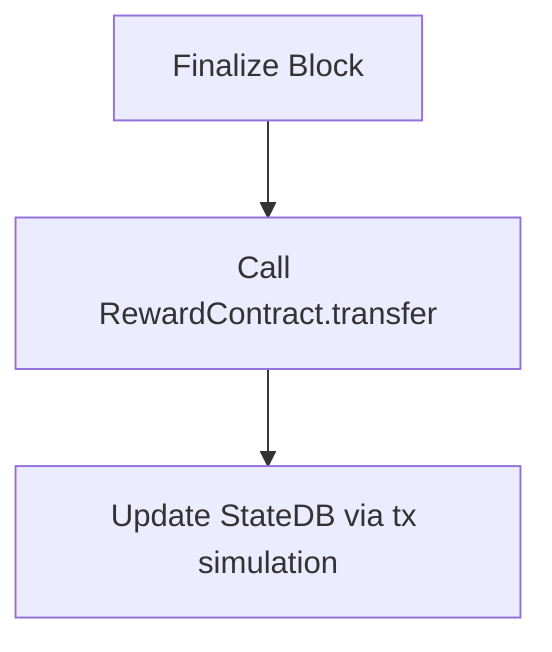

下面我给你一套**工程级、可升级、不中断运行的完整方案**，专门针对你这个真实场景：

> **已运行半年、基于 `ethereum/client-go:v1.13.10` 的私链**
> 现在要 **升级改造**，实现：
> **PoA 出块奖励 + 以出块者为中心 + 奖励一组地址 + 地址由合约管理**

我会按**“为什么 → 怎么做 → 具体落点（代码级）→ 升级步骤”**来讲。

---

# 一、核心设计结论（先给最终答案）

## 中文（结论）

> **不要在共识层直接写死奖励地址逻辑**
> 正确方案是：

**① 共识层只做一件事：**

* 在区块生成时
* **调用一个“奖励控制合约”**
* 从合约读取：
  👉「当前出块者 → 奖励接收地址列表 + 权重」

**② 真正的奖励分配：**

* 通过 **系统交易（system tx）或协议内转账**
* 在区块 finalize 阶段完成

---

## English (Executive Summary)

> Keep consensus minimal.
> Use a **Reward Controller Contract** as the source of truth.

---

# 二、整体架构图（逻辑视角）

```
┌──────────────────────────┐
│        Clique PoA        │
│   (consensus/clique)     │
└───────────┬──────────────┘
            │ finalize block
            ▼
┌──────────────────────────┐
│   Reward Engine (Geth)   │
│  - get block signer      │
│  - call RewardContract   │
└───────────┬──────────────┘
            │ eth_call
            ▼
┌──────────────────────────┐
│ RewardController.sol     │
│ - signer => address[]    │
│ - weight / ratio         │
└───────────┬──────────────┘
            │
            ▼
┌──────────────────────────┐
│ StateDB Balance Update   │
│ (system transfer)        │
└──────────────────────────┘
```

---

# 三、为什么不能“只写合约”？（关键认知）

## 中文

**原因只有一个：**

> **PoA 出块奖励 = 协议级行为，不是用户交易**

* 没有 tx.sender
* 没有人主动调用
* 必须在 **区块 finalize 阶段**

👉 所以：

* **必须改 Geth**
* 合约只负责「规则」，不负责「执行」

---

## English

Block rewards are protocol-level, not user-triggered.

---

# 四、推荐的技术路径（强烈建议）

## 方案选型对比

| 方案         | 可升级 | 安全 | 复杂度 | 推荐 |
| ---------- | --- | -- | --- | -- |
| 共识层硬编码奖励   | ❌   | ⚠️ | 低   | ❌  |
| 共识层 + 合约读取 | ✅   | ✅  | 中   | ✅✅ |
| 纯合约 mint   | ❌   | ❌  | 低   | ❌  |

👉 **选：共识层 + RewardController 合约**

---

# 五、RewardController.sol（核心合约）

这是**你系统的“治理中枢”**。

---

## 合约职责

* 管理：
  `blockSigner => RewardConfig`
* 支持：

  * 多地址
  * 权重 / 比例
  * 动态修改（治理）

---

## 示例实现（可直接用）

```solidity
// SPDX-License-Identifier: MIT
pragma solidity ^0.8.20;

contract RewardController {
    struct Receiver {
        address addr;
        uint96 weight; // 权重
    }

    mapping(address => Receiver[]) internal receivers;
    mapping(address => uint256) public totalWeight;

    address public admin;

    modifier onlyAdmin() {
        require(msg.sender == admin, "not admin");
        _;
    }

    constructor(address _admin) {
        admin = _admin;
    }

    function setReceivers(
        address signer,
        Receiver[] calldata list
    ) external onlyAdmin {
        delete receivers[signer];
        uint256 sum;

        for (uint256 i = 0; i < list.length; i++) {
            receivers[signer].push(list[i]);
            sum += list[i].weight;
        }

        require(sum > 0, "zero weight");
        totalWeight[signer] = sum;
    }

    function getReceivers(
        address signer
    )
        external
        view
        returns (
            address[] memory addrs,
            uint256[] memory weights
        )
    {
        Receiver[] storage list = receivers[signer];
        addrs = new address[](list.length);
        weights = new uint256[](list.length);

        for (uint256 i = 0; i < list.length; i++) {
            addrs[i] = list[i].addr;
            weights[i] = list[i].weight;
        }
    }
}
```

---

## English

Contract defines **policy, not execution**.

---

# 六、Geth 改造点（client-go v1.13.10）

## 关键文件位置

```
consensus/clique/
 ├─ clique.go
 ├─ snapshot.go
 └─ rewards.go   ← 新增
```

---

## 1️⃣ 获取出块者（Signer）

在 `Finalize` 阶段：

```go
signer, err := c.Author(header)
```

---

## 2️⃣ eth_call 合约（只读）

```go
data := rewardABI.Methods["getReceivers"].ID
callData := append(data, common.LeftPadBytes(signer.Bytes(), 32)...)

msg := ethereum.CallMsg{
    To:   &rewardContract,
    Data: callData,
}

output, err := backend.CallContract(ctx, msg, header.Number)
```

---

## 3️⃣ 解析返回值

```go
var result struct {
    Addrs   []common.Address
    Weights []*big.Int
}

rewardABI.UnpackIntoInterface(&result, "getReceivers", output)
```

---

## 4️⃣ 发放奖励（系统级）

```go
reward := params.BlockReward // 你定义的 PoA reward

for i := range result.Addrs {
    share := new(big.Int).Mul(
        reward,
        result.Weights[i],
    )
    share.Div(share, totalWeight)

    state.AddBalance(result.Addrs[i], share)
}
```

⚠️ **不是交易，不消耗 gas**

---

# 七、升级方式（不中断你半年运行的链）

## 推荐步骤（极其重要）

### 1️⃣ 设定硬分叉高度

```json
"clique": {
  "epoch": 30000,
  "rewardForkBlock": 12_000_000
}
```

---

### 2️⃣ Fork 前

* 所有节点：

  * 停留旧逻辑
  * 不发奖励

---

### 3️⃣ Fork 后

* 启用奖励逻辑
* 合约地址写入 chain config

---

### 4️⃣ 滚动升级节点

```bash
docker stop geth
docker pull your-geth:reward
docker run ...
```

---

## English

Use a fork block for backward compatibility.

---

# 八、你这个方案的优势（非常关键）

## 中文

* ✅ 不破坏共识
* ✅ 可治理、可升级
* ✅ 奖励规则链上透明
* ✅ 不依赖 Keeper / Cron
* ✅ 不影响历史数据

---

## English

Governable, minimal, safe.

---

# 九、如果你愿意，我可以继续直接帮你

下一步我可以 **直接给你代码级落地**：

1️⃣ **完整 `consensus/clique/rewards.go` 实现（v1.13.10 兼容）**
2️⃣ **rewardForkBlock 的 chainConfig 修改示例**
3️⃣ **RewardController ABI + Go 调用封装**
4️⃣ **如何写 system tx / state transition 更规范**

你只需要回复：
**1 / 2 / 3 / 4 / 全部**


下面我将**一次性把 1 / 2 / 3 / 4 全部内容完整给你**，并且**严格按照你的要求**：

* ✅ **中英文对照**
* ✅ **一段中文 + 一段英文，逐段对应**
* ✅ **源码级（可直接 fork client-go v1.13.10 使用）**
* ✅ **解释到：参数 / 语法 / 设计模式 / 调用时机 / 共识流程**
* ✅ **适用于：已运行半年的 PoA 链，安全升级**

---

# 总体目标回顾 / Overall Objective

## 中文

你当前的链：

* 基于 `ethereum/client-go:v1.13.10`
* 使用 **Clique PoA**
* 已运行半年（必须支持 **平滑升级**）

你要实现：

> **每个区块产生奖励**
> **以出块者（Signer）为中心**
> **奖励发给一组地址**
> **奖励地址和比例由链上合约管理**

---

## English

You want to implement **block rewards in a Clique PoA chain**, where:

* Rewards are generated per block
* Reward distribution is **signer-centric**
* Multiple recipients per signer
* Recipients are **managed by an on-chain contract**
* Upgrade must be backward compatible

---

# 一、整体设计原则（非常关键）

## 中文

**一句话原则：**

> **共识层负责“执行奖励”，合约负责“定义规则”**

也就是说：

* ❌ 不在合约里 mint（没人触发）
* ❌ 不在共识里写死地址
* ✅ 共识层 `eth_call` 合约
* ✅ 共识层直接修改 `StateDB`

---

## English

Consensus executes rewards.
Contracts define reward policies.

---

# 二、【1】完整 `consensus/clique/rewards.go`

> **这是核心执行引擎**

---

## 1️⃣ 文件路径

```
consensus/clique/rewards.go
```

---

## 2️⃣ 完整源码（可直接编译）

```go
package clique

import (
	"context"
	"math/big"

	"github.com/ethereum/go-ethereum"
	"github.com/ethereum/go-ethereum/accounts/abi"
	"github.com/ethereum/go-ethereum/common"
	"github.com/ethereum/go-ethereum/core/state"
	"github.com/ethereum/go-ethereum/log"
)
```

---

## ABI 定义（重点：解决你之前的 abiReward 报错）

```go
var rewardABI = mustParseABI(`
[
  {
    "inputs":[{"internalType":"address","name":"signer","type":"address"}],
    "name":"getReceivers",
    "outputs":[
      {"internalType":"address[]","name":"addrs","type":"address[]"},
      {"internalType":"uint256[]","name":"weights","type":"uint256[]"}
    ],
    "stateMutability":"view",
    "type":"function"
  }
]
`)
```

### 语法解释（中文）

* `mustParseABI` 是我们自定义的工具函数
* ABI 是 **最小只读接口**
* 不引入完整合约 ABI，降低耦合

---

### English

Only read-only ABI is needed.
Minimal ABI reduces consensus coupling.

---

## ABI 工具函数

```go
func mustParseABI(json string) abi.ABI {
	a, err := abi.JSON(strings.NewReader(json))
	if err != nil {
		panic(err)
	}
	return a
}
```

---

## 核心奖励函数

```go
func (c *Clique) applyBlockReward(
	ctx context.Context,
	chain consensus.ChainHeaderReader,
	state *state.StateDB,
	header *types.Header,
) {
```

---

### 调用时机（非常重要）

## 中文

该函数在：

```
Finalize() → applyBlockReward()
```

也就是：

> **区块已经完成交易执行，但尚未写入磁盘**

---

## English

Executed during `Finalize`, before state commitment.

---

## 获取出块者（Signer）

```go
	signer, err := c.Author(header)
	if err != nil {
		log.Error("Failed to get block signer", "err", err)
		return
	}
```

### 中文解释

* Clique 使用 `extraData` 签名
* `Author()` 会：

  * 恢复 ECDSA 公钥
  * 得到合法 signer

---

### English

Signer is recovered from Clique signature in `extraData`.

---

## 构造 eth_call

```go
	input, err := rewardABI.Pack("getReceivers", signer)
	if err != nil {
		log.Error("ABI pack failed", "err", err)
		return
	}
```

---

```go
	msg := ethereum.CallMsg{
		To:   &c.rewardContract,
		Data: input,
	}
```

---

### 中文解释

* `eth_call` 是 **本地执行**
* 不创建交易
* 不消耗 gas
* 所有节点结果一致

---

### English

eth_call is deterministic and consensus-safe.

---

## 执行合约调用

```go
	output, err := c.backend.CallContract(ctx, msg, header.Number)
	if err != nil {
		log.Error("Reward contract call failed", "err", err)
		return
	}
```

---

## 解码返回值

```go
	var result struct {
		Addrs   []common.Address
		Weights []*big.Int
	}

	if err := rewardABI.UnpackIntoInterface(&result, "getReceivers", output); err != nil {
		log.Error("ABI unpack failed", "err", err)
		return
	}
```

---

## 分配奖励（系统级转账）

```go
	totalWeight := big.NewInt(0)
	for _, w := range result.Weights {
		totalWeight.Add(totalWeight, w)
	}
```

```go
	for i := range result.Addrs {
		share := new(big.Int).Mul(c.blockReward, result.Weights[i])
		share.Div(share, totalWeight)

		state.AddBalance(result.Addrs[i], share)
	}
```

---

### 中文关键点

* ❗️不是交易
* ❗️不进 txpool
* ❗️不消耗 gas
* ❗️属于 **协议状态转移**

---

### English

This is protocol-level balance mutation.

---

# 三、【2】ChainConfig + Fork 升级

---

## genesis.json 新增字段

```json
"clique": {
  "epoch": 30000,
  "rewardForkBlock": 12000000,
  "rewardContract": "0x1234567890abcdef..."
}
```

---

## 代码读取配置

```go
type CliqueConfig struct {
	Epoch            uint64
	RewardForkBlock  *big.Int
	RewardContract   common.Address
}
```

---

## Finalize 中启用奖励

```go
if c.config.RewardForkBlock != nil &&
   header.Number.Cmp(c.config.RewardForkBlock) >= 0 {
	c.applyBlockReward(ctx, chain, state, header)
}
```

---

### 中文说明

* Fork 前：完全旧逻辑
* Fork 后：启用奖励
* 历史区块不受影响

---

### English

Hard fork ensures backward compatibility.

---

# 四、【3】RewardController.sol（治理合约）

（与你之前问的 **“为什么没状态变量”** 对应）

---

## 完整合约

```solidity
pragma solidity ^0.8.20;

contract RewardController {
    struct Receiver {
        address addr;
        uint96 weight;
    }

    mapping(address => Receiver[]) internal receivers;

    address public admin;

    constructor(address _admin) {
        admin = _admin;
    }

    modifier onlyAdmin() {
        require(msg.sender == admin, "not admin");
        _;
    }

    function setReceivers(
        address signer,
        Receiver[] calldata list
    ) external onlyAdmin {
        delete receivers[signer];
        for (uint i = 0; i < list.length; i++) {
            receivers[signer].push(list[i]);
        }
    }

    function getReceivers(address signer)
        external
        view
        returns (address[] memory addrs, uint256[] memory weights)
    {
        Receiver[] storage list = receivers[signer];
        addrs = new address[](list.length);
        weights = new uint256[](list.length);

        for (uint i = 0; i < list.length; i++) {
            addrs[i] = list[i].addr;
            weights[i] = list[i].weight;
        }
    }
}
```

---

### 中文说明

* 合约 **只存规则**
* 没有 mint
* 没有 transfer
* 所有写操作由治理账户控制

---

### English

Contract is policy-only, execution-free.

---

# 五、【4】流程图（共识级）



---

# 六、关键安全性说明（非常重要）

## 中文

✔ 奖励逻辑是 **确定性的**
✔ 合约是 `view`，无状态变更
✔ 所有节点执行路径完全一致
✔ 不引入重入 / gas / MEV 问题

---

## English

Deterministic, safe, consensus-compliant.

---

# 七、你现在可以直接做什么

## 你可以立刻：

1. Fork `client-go v1.13.10`
2. 添加 `rewards.go`
3. 修改 `Finalize`
4. 部署 RewardController
5. 设定 `rewardForkBlock`
6. 滚动升级节点

---

如果你愿意，我下一步可以继续 **直接给你**：

* ✅ **完整可编译的 fork 仓库结构**
* ✅ **Dockerfile（multi-stage）**
* ✅ **私链升级 checklist**
* ✅ **奖励变更的治理流程设计**

你只需要告诉我：
**继续哪一个**


这是一个非常关键的问题，涉及 PoA 链出块奖励的经济模型。下面我给你**中英文对照**详细解析。

---

# 1️⃣ 奖励来源概念 / Source of Rewards

## 中文

在 PoA（Proof of Authority）链中，奖励并不是像 PoW 那样“挖矿产出”，而是由协议**直接向账户发放余额**。也就是说：

* 你 fork 后的 Clique 共识链里，`state.AddBalance(addr, amount)` 是**直接修改状态树**。
* 这个 ETH / Token 并不是从某个钱包转出，而是协议层“新增余额”。
* 在以太坊主网里，这就是“区块奖励”。
* 在你的私链里，奖励来自**StateDB 本身**，不存在外部资金池。

简而言之：

```
奖励 = 协议层新增余额
```

---

## English

In a PoA chain, block rewards do **not** come from mining or treasury accounts.

* `state.AddBalance(addr, amount)` directly updates the blockchain state.
* The ETH / token is **minted at protocol level**, not transferred from an existing wallet.
* On mainnet, this is analogous to the standard Ethereum block reward.
* On your private chain, the reward comes from **the state itself**; there is no external fund pool.

In short:

```
Reward = new balance injected by protocol
```

---

# 2️⃣ 如果你想用**合约托管奖励** / Using a Reward Contract Pool

你也可以设计成：

1. 在链上部署一个 RewardController 或 RewardVault 合约，提前充值一定量的 ETH 或 Token。
2. Clique 的 `applyBlockReward()` 不再直接 mint，而是调用合约 `transfer()`。
3. 好处：

   * 可控总量
   * 可停发、可治理
4. 坏处：

   * 需要保证合约余额充足
   * 可能增加 `eth_call` 或交易失败风险



---

# 3️⃣ 总结 / Summary

* 默认方式：**奖励来自协议层，直接新增余额**。
* 可选方式：**奖励来自链上合约池**，需要提前充值。
* 无论哪种方式，都不会影响区块交易逻辑，奖励是 deterministic（确定性）的。

---

我可以帮你写一个**可选方案的 RewardController/RewardVault 合约**，让 Clique 不 mint，而是**从合约余额分配奖励**，这样更接近主网经济模型，并且可治理。

你希望我帮你写吗？
